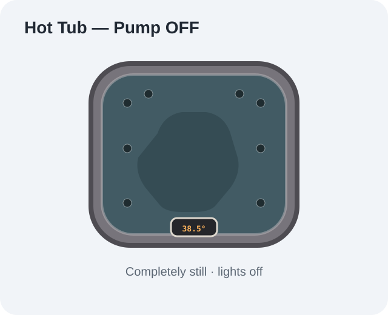
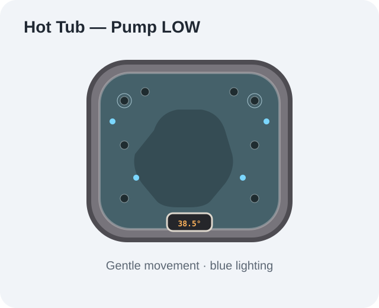
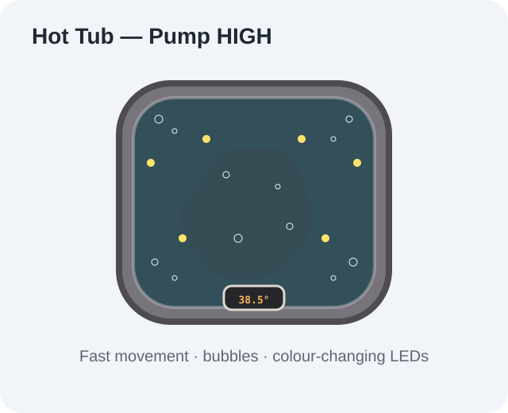

# Hot Tub Animated Home Assistant Card

A custom Home Assistant Lovelace card for an animated hot tub visual, built with inline HTML, CSS and SVG. No external or raster images are used by the card itself.

## Features

- Animated hot tub rendered directly with SVG/CSS
- Pump OFF mode: completely still, with animation and lights disabled
- Pump LOW mode: gentle water movement, ripples and blue lighting
- Pump HIGH mode: faster water movement, dense internal bubbles and synchronised colour-changing LEDs
- Bubbles stay clipped inside the tub shell
- Bubble sources are distributed around the tub, including the corners
- Responsive Lovelace card layout
- Uses a Home Assistant pump entity to control the animation
- No iframe and no external image dependency

## Screenshots

### Pump OFF



Completely still with the lighting and water effects disabled.

### Pump LOW



Gentle water movement with blue lighting and slower ripple effects.

### Pump HIGH



Fast water movement, synchronised colour-changing LEDs and dense bubbles.

> The screenshot files are static documentation images; the card itself remains fully animated in Home Assistant.

## Installation

### HACS — Custom Repository

Until the card is available through the normal HACS store, add this repository as a custom repository:

1. Open **HACS** in Home Assistant.
2. Go to **Frontend**.
3. Open the **⋮** menu in the top-right.
4. Select **Custom repositories**.
5. Enter:

   `https://github.com/idarkside/hot_tub_animated_ha_card`

6. Select **Lovelace** as the category.
7. Click **Add**.
8. Find **Hot Tub Animated Card** and install it.
9. Restart Home Assistant if requested.
10. Add the card to your dashboard using the configuration below.

### Manual installation

Download `hot-tub-animated-ha-card.js` and place it in:

`/config/www/`

Then add it under **Settings → Dashboards → Resources**:

```yaml
resources:
  - url: /local/hot-tub-animated-ha-card.js
    type: module
```

## Configuration

```yaml
type: custom:hot-tub-animated-ha-card
title: Hot Tub
pump_entity: switch.example_hot_tub_pump
```

### Options

| Option | Required | Description |
|---|---|---|
| `type` | Yes | `custom:hot-tub-animated-ha-card` |
| `title` | No | Title displayed at the top of the card. Defaults to `Hot Tub`. |
| `pump_entity` | Yes | Home Assistant entity whose state controls the animation. |

## Pump state mapping

| Entity state | Animation |
|---|---|
| `off`, `idle`, `unavailable`, `unknown`, `0` | OFF — completely still |
| `low`, `medium`, `on`, `1` | LOW — gentle movement and blue lighting |
| `high`, `boost`, `strong`, `2+` | HIGH — fast movement, bubbles and colour-changing LEDs |

## Updating

If installed through HACS, use **HACS → Frontend → Hot Tub Animated Card → Update** when a new version is released.

After updating, clear the browser cache or perform a hard refresh if Home Assistant continues displaying the previous JavaScript version.

## Repository

https://github.com/idarkside/hot_tub_animated_ha_card
