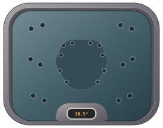

# Hot Tub Animated Home Assistant Card

A custom Home Assistant Lovelace card for an animated hot tub visual, built with HTML, CSS and animated SVG. No raster images are used by the card.

[](https://my.home-assistant.io/redirect/hacs_repository/?owner=idarkside&repository=hot_tub_animated_ha_card&category=dashboard)

## Features

- Animated Wellis Shine 2 visual rendered with SVG
- Three dedicated animated SVG states: OFF, LOW and HIGH
- Pump OFF: completely still, with animation and lights disabled
- Pump LOW: gentle water movement, ripples and blue lighting
- Pump HIGH: fast water movement, dense internal bubbles and synchronised colour-changing LEDs
- Bubbles stay clipped inside the tub shell
- Bubble sources are distributed around the tub, including all four corners and other internal areas
- Bubble movement varies in direction
- Responsive Lovelace card layout
- Uses a Home Assistant pump entity to select the animation state
- No iframe and no raster image dependency

## Animated SVG states

The card now uses real animated SVG files rather than keeping the complete animation embedded in the JavaScript:

- `svg/pump-off.svg` — still tub, no active effects
- `svg/pump-low.svg` — gentle water movement and blue LEDs
- `svg/pump-high.svg` — fast water movement, internal bubbles and synchronised colour-changing LEDs

These are genuine SVG files containing their own CSS animations. The Home Assistant card switches between them as the pump entity changes state.

## Preview

### Pump OFF



Completely still with the lighting and water effects disabled.

### Pump LOW



Gentle water movement with blue lighting and slower ripple effects.

### Pump HIGH



Fast water movement, synchronised colour-changing LEDs and dense bubbles.

> GitHub may display animated SVG previews according to its own rendering behaviour. The same SVG files are used by the live Home Assistant card.

## Installation

### Add with HACS

Use the button above to open the repository directly in HACS.

If the button is not available, add the repository manually:

1. Open **HACS** in Home Assistant.
2. Go to **Frontend**.
3. Open the **⋮** menu in the top-right.
4. Select **Custom repositories**.
5. Enter:

   `https://github.com/idarkside/hot_tub_animated_ha_card`

6. Select **Dashboard** as the category.
7. Click **Add**.
8. Find **Hot Tub Animated Card** and install it.
9. Restart Home Assistant if requested.

### Manual installation

Download `hot-tub-animated-ha-card.js` and the `svg/` directory, then place them together under `/config/www/`.

For example:

```text
/config/www/hot-tub-animated-ha-card.js
/config/www/svg/pump-off.svg
/config/www/svg/pump-low.svg
/config/www/svg/pump-high.svg
```

Then add the card resource under **Settings → Dashboards → Resources**:

```yaml
resources:
  - url: /local/hot-tub-animated-ha-card.js
    type: module
```

## Configuration

```yaml
type: custom:hot-tub-animated-ha-card
title: Hot Tub
pump_entity: switch.example_hot_tub_pump
```

### Options

| Option | Required | Description |
|---|---|---|
| `type` | Yes | `custom:hot-tub-animated-ha-card` |
| `title` | No | Title displayed at the top of the card. Defaults to `Hot Tub`. |
| `pump_entity` | Yes | Home Assistant entity whose state controls the animation. |

## Pump state mapping

| Entity state | Animation |
|---|---|
| `off`, `idle`, `unavailable`, `unknown`, `0` | OFF — completely still |
| `low`, `medium`, `on`, `1` | LOW — gentle movement and blue lighting |
| `high`, `boost`, `strong`, `2+` | HIGH — fast movement, bubbles and colour-changing LEDs |

## Updating

If installed through HACS, use **HACS → Frontend → Hot Tub Animated Card → Update** when a new version is released.

After updating, clear the browser cache or perform a hard refresh if Home Assistant continues displaying the previous JavaScript version.

## Repository

https://github.com/idarkside/hot_tub_animated_ha_card
